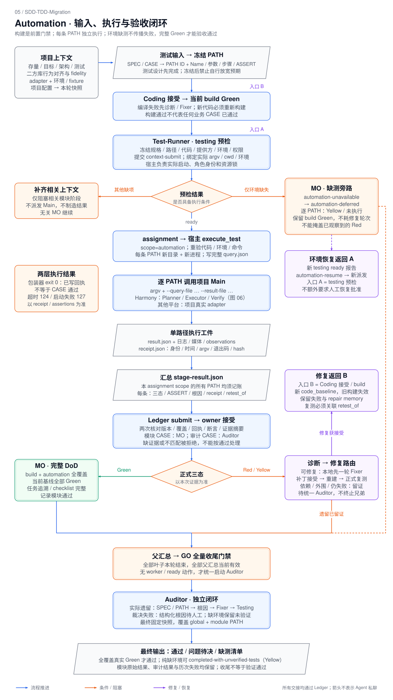
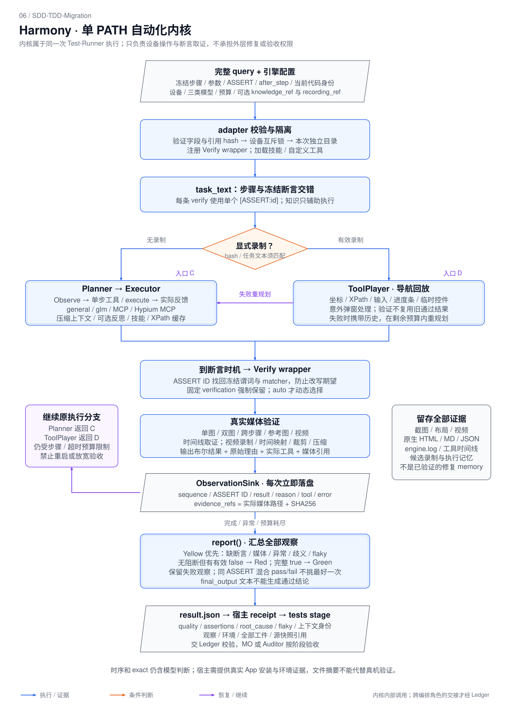

# 自动化测试：输入、输出与完整控制流

核对日期：2026-09-19。范围为本包当前协议、模板、宿主执行脚本和内置 Harmony 内核；这是现状说明，不更改运行协议。以下 JSON 是格式示例，占位摘要、路径和执行结果均不是实际测试证据。

## 1. 自动化在整个迁移流程中的位置

**Test-Runner 设计测试 → SPEC/PATH 冻结 → Coding 接受 → build Green → automation 预检 → 逐 PATH 执行 → 结果验收 → 修复复测 / DoD → 全量收尾后 Auditor。**

- 测试设计可以提前，自动化执行必须晚于代码接受和当前代码的构建通过。
- `Main` 是项目实际验证入口，不是固定文件名。`execute_test.py` 是宿主包装器，Harmony 是已内置的一种 Main；其他平台需要真实项目 adapter。
- Test-Runner 执行和产出证据；模块 CASE 由 MO 唯一验收，审计 CASE 由 Auditor 唯一验收。缺陷修复交 Fixer，不能由测试执行器或 Auditor 越权修改源码/验收标准。
- **自动化环境不可用可以结束本轮调度，但仍是 Yellow/未验证。** 它不让其他独立 MO 失败，也不取消可执行下游。



[PNG](automation-flow.png) · [Harmony 内核详图](automation-engine.svg)

## 2. 输入分层：用户提供什么，系统生成什么

| 层次 | 输入与样式 | 生成/确认者 | 消费者 |
| --- | --- | --- | --- |
| 项目配置 | legacy/target、架构/需求、`test_cases_path`、`test_adapter`、知识、复用来源；JSON + 文件路径 | 用户输入，宿主持久化并 prepare 固化 | GO / 父子 MO |
| 功能与 CASE | 模块功能、REQ/CASE、SPEC 草稿、模块 Testing list | GO 分配，父 MO 按 scope 拆分 | 子 MO / Spec-Designer / Test-Runner |
| 测试设计 | `stage-plan.paths[]`：稳定 ID、Name、前置、步骤、参数、ASSERT、依赖；`kind=automation` | Test-Runner 设计；随 SPEC 审核冻结 | 执行模式 Test-Runner |
| 执行授权 | Ledger assignment、`test_scope=automation`、`freeze_id`、`code_baseline`、执行实例；ready 上下文报告 | 实际执行实例预检，MO/审计节点接受 | 宿主 `execute_test.py` |
| 单路径 query | **完整冻结 PATH** + run/module/freeze/code 身份，JSON 文件 | `execute_test.py` 从 Ledger 组装 | 项目 Main / Harmony adapter |
| 引擎配置 | adapter argv/timeout；Harmony device、模型、服务地址、可选录制/知识引用 | 宿主配置，经上下文预检 | adapter / 内核 |

没有提供测试汇总时，工作流先从存量源码提取完整功能列表并补测试草案；不能把缺 CASE 当作免测。设计期依据审核后的行为基线和规格确定期望，执行期不能反过来读取目标实现推导“正确答案”。复用二方库的场景仍须保留源码行为对齐和 fidelity PATH/ASSERT。

### 2.1 用户配置与 CLI adapter 是两种 JSON

项目级 `test_adapter` 使用以下形状，见 [global-input.json](../template/global-input.json)：

```json
{
  "test_adapter": {
    "executable": "/opt/venvs/harmony/bin/python",
    "args": ["/work/SDD-TDD-Migration/skills/migration-test/scripts/harmony_adapter.py", "--config", "/work/context/harmony-config.json"],
    "cwd": "/work/target",
    "query_transport": "query-file",
    "result_format": "migration-test-result-v1",
    "timeout_seconds": 1860,
    "environment_ref": "/work/context/test-environment.md"
  }
}
```

`execute_test.py --adapter` 实际读取的是下面的 **argv 文件**，不能直接把上述完整项目配置传进去：

```json
{
  "argv": ["/opt/venvs/harmony/bin/python", "/work/SDD-TDD-Migration/skills/migration-test/scripts/harmony_adapter.py", "--config", "/work/context/harmony-config.json"],
  "timeout": 1860
}
```

宿主负责映射 `argv=[executable,*args]`、`timeout=timeout_seconds`，并以 `--cwd` 传入工作目录。实际命令还必须匹配 ready 报告中的 `execution.argv/cwd/environment_ref`；最终审计混合路径可用 `execution.commands[path_id]` 指定各路径命令。

Harmony 配置的独立输入见 [harmony-config.json](../template/harmony-config.json)：

- 必填明确的设备序列号，不自动选择设备。
- Planner / Executor / Verify 模型分别配置，密钥使用 `{"env":"VARIABLE_NAME"}`。
- 执行器支持 `general / glm / mcp_agent / hypium_mcp_agent`。
- `knowledge_ref`、`recording_ref` 是 `{path,sha256}`；读取前校验摘要。录制还需匹配本次完整任务文本。
- 默认引擎预算 1800 秒、宿主模板 1860 秒；总步数、Executor 步数、压缩/反思/视频均在配置中控制。
- 环境材料还需说明 fixture、账号、工具依赖和目标 App 安装证据。adapter 不会安装 App，也不会自动证明设备上安装的包对应当前代码。

### 2.2 测试用例导入的输入/输出

工作流内：`harmony_design.py --root <run_root> --input <MD/XMind> --module M001 --output <run_root>/runs/harmony/sandbox/test-designer/<新请求>`；省略 --root 仅用于独立导入。

| 输入 | 实际处理 | 输出 |
| --- | --- | --- |
| Markdown | 识别 `## 用例描述：` 标题，保留块内原文 | `source.md`、`test-design-draft.json` |
| XMind | 提取全部主题树，经配置模型转换 Markdown，再提取候选 | 以上文件 + `xmind-tree.txt`、`converted.md` |

候选标记为 `draft-not-executable`：`requirement_id=null`、steps/assertions 待补。这一步不等于已完成语义拆分或冻结。Test-Runner 仍需人工可审核的 CASE/REQ 映射、参数展开、正常/边界/异常覆盖和断言时序。导入候选 ID 依赖内容摘要，审核时要对齐已有稳定 ID，冻结后不能因名称调整而重编号。

### 2.3 真正交给 Main 的 query 样式

每条参数实例单独 PATH。下面是一条 Harmony UI 路径的完整执行数据示例：

```json
{
  "path_id": "PATH-M001-001",
  "name": "播放页暂停后展示继续播放按钮",
  "case_id": "CASE-M001-001",
  "requirement_id": "REQ-M001-001",
  "kind": "automation",
  "required": true,
  "scope": "module",
  "preconditions": ["安装包与当前 code_baseline 对应", "测试账号已登录，固定视频正在播放"],
  "steps": ["打开播放控制面板", "点击暂停按钮"],
  "parameters": {"video_id": "fixture-video-001"},
  "dependency_refs": [],
  "expected_assertions": [{
    "assertion_id": "ASSERT-M001-001",
    "expected": true,
    "description": "暂停操作后，播放控制面板显示继续播放按钮",
    "matcher": "exact",
    "verification": "one_image_assert",
    "after_step": 2
  }],
  "run_id": "RUN-DEMO",
  "module_id": "M001",
  "freeze_id": "<真实冻结计划摘要>",
  "code_baseline": "<真实代码清单摘要>"
}
```

字段边界：

- 前半部分来自冻结 PATH；最后四个身份字段由宿主写入。`assignment_id/test_run_id` 位于回执及阶段结果中，当前 query 不包含它们。
- `name` 用于理解和检索，不能作为 shell 命令执行。宿主传递完整 query 文件，而非仅 ID/Name。
- 通用 Main 的 expected 可为 JSON 标量；Harmony 当前要求 `expected=true` 加明确布尔谓词、matcher、verification 和 after_step。不能把数值型用例直接改成 true。
- Harmony verification 支持 `one_image_assert / multi_image_assert / cross_step_image_assert / refer_image_assert / video_assert / auto`。固定模式不得降级替换。
- [harmony-test-path.json](../template/harmony-test-path.json) 是路径片段；新拆分运行纳入 stage-plan 时须补 `kind=automation`。该片段本身不包含运行身份，也不是可直接执行的完整 query。

## 3. 执行过程：授权、内核与证据

### 3.1 外层逐 PATH 执行

1. Test-Runner 提交 `stage=testing` 上下文报告，检查 frozen-spec、test-paths、accepted-code、provider-binding、test-environment、permissions-tools。
2. 环境就绪，MO 派发有效 assignment；宿主调用 `execute_test.py`。脚本再次核对阶段、scope、代码、命令与环境引用。
3. 创建新的执行目录，写 `query.json`；调用 `argv + [--query-file, query, --result-file, result]`。
4. Main 执行实际测试；宿主收集 stdout/stderr、时间、退出码。每条 PATH 独立子进程；超时杀掉整个进程组。
5. 宿主保存回执；全部本次 scope 路径执行/记账后组装 tests stage。Harmony 使用 `harmony_stage.py`，其他 adapter 按通用 tests 契约组装。
6. submit/accept 两次校验后才成为正式 Ledger 结果。生成文件、退出码 0 或 Agent 文字“通过”都不能独立完成验收。

宿主执行示例（路径、assignment 须替换为真实值）：

```sh
python3 /work/SDD-TDD-Migration/skills/migration-ledger/scripts/execute_test.py \
  --root /work/migration/.sdd-runs/run-demo --module M001 --assignment ASG-DEMO \
  --path-id PATH-M001-001 --adapter /work/migration/.sdd-runs/run-demo/runs/harmony/sandbox/host/adapter/adapter.json \
  --cwd /work/target --output /work/migration/.sdd-runs/run-demo/runs/harmony/automation/path-m001-001-attempt-001
```

**注意两层退出码**：Harmony 子进程为 0/1/2，含义分别为 Green/Red/Yellow，记录在 receipt.exit_code。外层 `execute_test.py` CLI 正常完成回执写入时返回 0，即使子进程测试失败；宿主必须读取 receipt/result，不能把包装器退出成功当测试成功。

### 3.2 Harmony 内部过程



1. 校验 query、配置、依赖、设备；获取设备文件锁，在本次 `harmony/` 目录运行。
2. 把前置、参数、步骤和断言转为交错任务文本；每条断言使用单个 `[ASSERT:id]`。已校验知识只辅助执行，不改预期。
3. 无录制走 Planner；有显式有效录制走 ToolPlayer。回放复用坐标/XPath/动作，但 Verify 仍操作本轮媒体；失败可在剩余预算内触发 Planner 重规划。
4. Planner 单步调用 Executor、技能/工具或 Verify。Executor 观察页面、操作设备并反馈；压缩上下文、XPath 缓存、工具录制及可选反思支持后续决策。
5. Verify wrapper 用 ASSERT ID 找回冻结描述与匹配规则，再由内核选择媒体/步骤进行验证。保留单图、双图、跨步骤、参考图、视频能力。
6. 每次观察立刻写 observations；记录 ASSERT ID、顺序、工具、布尔结果、理由、媒体路径和摘要。
7. `ObservationSink.report()` 汇总全部观察，生成三态、断言列表、root_cause；附环境快照、媒体/报告/录制引用。最终自然语言文本只作为报告内容。

内部重规划只是测试导航恢复，不能调用外层 Fixer、更改 SPEC 或占用代码修复角色。压缩记忆和录制是候选执行素材，不等于 Ledger 已验证的修复 memory。

## 4. 输出分层及样式

### 4.1 文件系统

```text
<run_root>/runs/harmony/automation/<新的单 PATH attempt>/
├── query.json             # 宿主组装的完整冻结路径
├── result.json            # Main 的结构化断言结果；崩溃时可能不存在
├── execution.log          # 宿主捕获 stdout/stderr
├── receipt.json           # 宿主事实：命令、身份、时间、退出码、文件摘要
└── harmony/               # 使用 Harmony 时生成
    ├── observations.json  # 每次 ASSERT 观察，立即落盘
    ├── environment.json   # 配置/设备/运行库版本/源快照引用
    ├── engine.log
    ├── reports/           # 原生 HTML/Markdown/JSON 时间线及截图/布局
    ├── memory/            # 候选工具录制；是否保存受内核执行结果影响
    └── <媒体工件>          # 视频、裁剪/映射等；实际位置由内核产生

<run_root>/runs/harmony/sandbox/<角色>/<请求>/stage-result.json # 全 scope 汇总，尚未验收
<run_root>/...                         # Ledger 事件与状态投影，接受后更新
```

异常/强制超时可能只有部分工件；缺文件不能补造。标准结构化结果在执行目录的 `result.json`，不是一份固定存在的 `harmony/report.json`。审计最终报告和模块测试记录独立保留。

### 4.2 Main 结构化结果：一条 PATH

下面是 Harmony Green 的字段投影，实际输出还含 query 摘要、observations/environment/artifacts/engine 引用和原生 final_output：

```json
{
  "schema_version": 1,
  "producer": "harmony-adapter",
  "run_id": "RUN-DEMO",
  "module_id": "M001",
  "path_id": "PATH-M001-001",
  "freeze_id": "<冻结摘要>",
  "code_baseline": "<代码摘要>",
  "quality": "green-passed",
  "flaky": false,
  "skipped": false,
  "assertions": [{
    "assertion_id": "ASSERT-M001-001",
    "expected": true,
    "actual": true,
    "passed": true,
    "evidence_ref": {"path": "/work/attempt/harmony/observations.json", "sha256": "<真实摘要>"}
  }],
  "root_cause": null
}
```

Red/Yellow 的 `root_cause` 至少提供 category、summary、confidence、owner、next_action，协议还要求证据引用；Harmony 同时输出 suspected_owner。断言失败只说明现象，具体缺陷归因由 Diagnostician 补充，不能宣称测试引擎已经证明根因。

### 4.3 宿主回执：执行事实与绑定

`receipt.json` 的实际字段：

```text
schema_version, producer="host-executor",
run_id, module_id, path_id, test_run_id,
assignment_id, actor_instance_id, freeze_id, code_baseline,
argv, cwd, started_at, finished_at, exit_code,
log_ref={path,sha256}, query_ref={path,sha256}, result_ref={path,sha256}|null
```

`test_run_id` 每次新生成；即使没有 result，超时/启动失败仍留日志和回执，退出码通常为 124/127。摘要绑定证据内容，但信任仍依赖宿主保护回执和身份目录。

### 4.4 tests stage：提交与验收的单位

下面是阶段结果结构示例，`paths` 必须包含本 assignment scope 的**全部**路径：

```json
{
  "schema_version": 1,
  "kind": "tests",
  "run_id": "RUN-DEMO",
  "module_id": "M001",
  "assignment_id": "ASG-DEMO",
  "actor_instance_id": "TR-DEMO",
  "freeze_id": "<冻结摘要>",
  "code_baseline": "<代码摘要>",
  "paths": [{
    "path_id": "PATH-M001-001",
    "test_run_id": "<本次回执 UUID>",
    "quality": "green-passed",
    "executed": true,
    "flaky": false,
    "assertions": [{"assertion_id": "ASSERT-M001-001", "expected": true, "actual": true, "passed": true, "evidence_ref": {"path": "/work/attempt/harmony/observations.json", "sha256": "<真实摘要>"}}],
    "root_cause": null,
    "execution_receipt": {"path": "/work/attempt/receipt.json", "sha256": "<真实摘要>"},
    "retest_of": "<前次失败或过期结果的 test_run_id>"
  }]
}
```

- 首次运行不必填写 retest_of；旧结果非 Green 或已 stale 时必须指向旧 ID，并使用新的 test_run_id。
- `executed=true` 表示可读取本次 adapter 完成报告，不保证每一步 CASE 已成功执行；真实验证结论仍看 quality/assertions。启动失败或缺完成报告可为 executed=false Yellow，并保留回执。
- `harmony_stage.py` 不会自动 submit/accept，也不能自动解析任意项目 adapter：它识别 `harmony-adapter` 和 `build-executor`。其他 Main 按通用 stage 契约组装。
- `module_id=GLOBAL` 最终审计另含 assignment 的 `snapshot`。不能把一个模块的 scope 缩成少数通过 PATH 提交。
- [test-result.json](../template/test-result.json) 是更完整的报告模板；本地提交实际以 [stage-result.json](../template/stage-result.json)、回执及 `contracts.validate_result()` 为准，两者不是同一个 JSON。

### 4.5 环境未启动：Ledger 缺测记录

这个分支来自 testing blocked 报告和 `automation-unavailable`，**不是 Main 执行结果**。Ledger 为每条 automation PATH 生成：

```json
{
  "path_id": "PATH-M001-001",
  "test_run_id": "<request_id>:PATH-M001-001",
  "quality": "yellow-blocked",
  "executed": false,
  "reason_code": "automation-not-run",
  "assertions": [],
  "retest_of": null,
  "root_cause": {
    "category": "automation-environment",
    "summary": "指定测试设备不可连接，未执行自动化",
    "confidence": "confirmed",
    "owner": "test-environment-owner",
    "next_action": "恢复设备并提交新的 testing ready 报告",
    "missing": ["可连接的指定设备"],
    "evidence_refs": [{"path": "/work/context/testing-blocked.json", "sha256": "<真实摘要>"}]
  }
}
```

门禁严格限定：只有 `test-environment` blocked，其他预检 ready；当前 build Green、代码有效、无活动 worker，且不能掩盖当前代码已观察到的 Red。模块状态为 `automation-deferred`，保持构建结果，不耗 Fixer 轮次；恢复 ready 后 `automation-resume` 再真实复测。

## 5. 三态、修复与全局收尾

| 结果 | Harmony 当前判定 | 外层动作 |
| --- | --- | --- |
| Green | 冻结 ASSERT 齐全、有效媒体/类型、全部观察 true、无执行异常、exit 0 | MO 校验覆盖/证据/DoD 后记录；审计范围由 Auditor 验收 |
| Red | 无阻断项，存在有效媒体支持的 false 断言 | Diagnostician 定位；可修复问题优先一轮 Fixer；新代码必须重新构建和正式 Testing |
| Yellow（运行中） | 缺 ASSERT/媒体、异常/超时、解析歧义、未知身份、模式不符、同断言 pass/fail 混合 | 诊断；可修复则一轮 Fixer，确认依赖/外围或修复仍失败则留证待 Auditor |
| Yellow（环境缺测） | testing 预检仅环境 blocked，满足专门门禁 | automation-deferred；不强迫人工、不阻塞无关任务，最终列入缺测报告 |

Harmony 中 **阻断优先于 Red**：同次运行已有失败断言但又有缺证据等阻断时，总体可能为 Yellow；失败断言仍须保留。该情况不能读成“没有发生失败”。同轮 flaky 保留全部尝试，不能只挑最后一次 Green。

所有叶子 MO 各自完成/明确收尾、所有父汇总有效、无在途 worker 和 ready 动作后，GO 才启动统一 Auditor：

1. 收集实际 Red/其他 Yellow，读取相应 SPEC/PATH/代码与根因证据，独立复现或明确记不可执行。
2. 按责任和依赖派发 Fixer；修复后重建、模块/受影响路径 Testing，Auditor 独立裁决。失败保留根因待人工。
3. 纯自动化环境缺测不塞入源码 Fixer 队列；环境可用时仍要真实验证这些路径。
4. 独立审计绑定全部模块代码快照，但只执行 Red/Yellow 遗留和有依据的受影响回归；不会把所有模块路径加入清单。global_paths 可为空，零待测路径只做 audit-review。
5. 最终仅缺环境且其他问题已收尾，可 `audit-unavailable` 输出 `completed-with-unverified-tests`，质量保持 Yellow。该审计缺测记录仅包含当前选中的待验证路径，已有模块构建 Green 单独保留，不能声称构建证据被抹掉。

## 6. 当前能力边界与阅读注意

1. **不是一条脚本自动跑完整迁移。** Ledger 校验状态，宿主负责启动实例、派发、执行、提交/接受和资源锁；内核只承担一次测试执行。
2. **after_step 与 exact 的强度有限。** 时序通过任务文本/Planner 约束和时间线审核，尚无确定性逐步骤监视器；Harmony exact 传给模型验证，不等于确定性字符串比较器。要求严格数值/文本 equality 时采用项目测试脚本。
3. **flaky 的实现分两层。** ObservationSink 对同轮混合观察强制 Yellow；协议要求定位/修复后按策略连续通过（默认 3 次），当前 `contracts.validate_result()` 没有统一连续三次计数门禁，不能把该要求描述为全部自动强制执行。
4. **模板需实例化。** 项目 test_adapter 与 CLI argv 格式不同；Harmony PATH 片段需补 kind；通用 context-readiness 模板默认是 coding，testing 必须使用运行期 context_requirements 给出的检查集合和 subject 摘要。
5. **证据完整与真机功能正确不同。** 当前静态核对能够确认接口、调用链及门禁；本说明没有执行真实 App/设备/模型，不宣称真机测试通过或源能力无劣化。

## 7. 源码定位

| 节点 | 当前源码 / 协议 |
| --- | --- |
| 角色、构建与缺测分流 | [Test-Runner](../Agents/test-runner.md)、[build-automation](../skills/migration-protocol/references/build-automation.md) |
| 输入/断言/复测契约 | [testing](../skills/migration-protocol/references/testing.md)、[Harmony 协议](../skills/migration-test/references/harmony-runtime.md) |
| 用例候选生成 | [harmony_design.py](../skills/migration-test/scripts/harmony_design.py) |
| 单路径执行与回执 | [execute_test.py](../skills/migration-ledger/scripts/execute_test.py) |
| ready 与命令校验 | [context_readiness.py](../skills/migration-ledger/scripts/context_readiness.py) |
| adapter / 断言归一化 | [harmony_adapter.py](../skills/migration-test/scripts/harmony_adapter.py)、[harmony_contract.py](../skills/migration-test/scripts/harmony_contract.py) |
| 原生规划 / 回放 / 验证 | [main.py](../skills/migration-test/runtime/harmony/main.py)、[decision.py](../skills/migration-test/runtime/harmony/AutoTest/layered_agent_cli/decision.py)、[tool_player.py](../skills/migration-test/runtime/harmony/AutoTest/memory/tool_player.py)、[Verify](../skills/migration-test/runtime/harmony/AutoTest/verify_agent/agent.py) |
| 阶段组装 / 接受 | [harmony_stage.py](../skills/migration-test/scripts/harmony_stage.py)、[contracts.py](../skills/migration-ledger/scripts/contracts.py)、[ledger.py](../skills/migration-ledger/scripts/ledger.py) |
| 缺环境旁路 / 审计 | [test_validation.py](../skills/migration-ledger/scripts/test_validation.py)、[audit_closure.py](../skills/migration-ledger/scripts/audit_closure.py) |

绘图源：[generate_automation.py](generate_automation.py)。本页及两张图描述当前实现；若协议或运行脚本后续变化，应同步核对。
