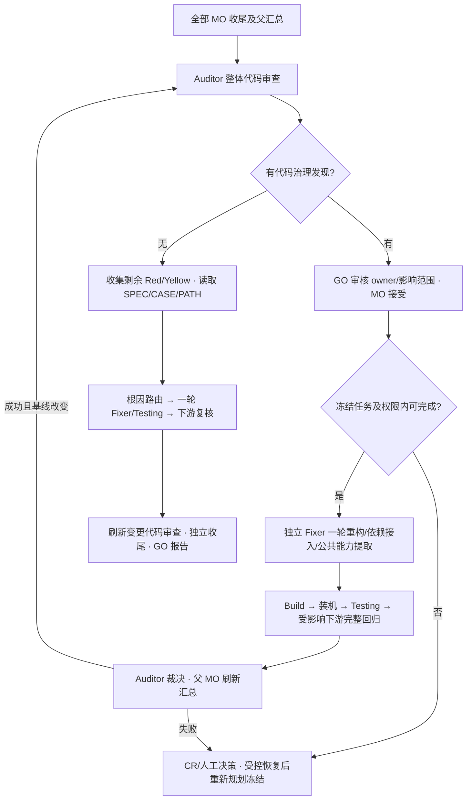

# Auditor 整体代码治理

## 顺序与职责

全部叶子 MO 本轮实现、Build、Automation/缺测记录和修复收尾，父 MO 汇总有效后：

Auditor **负责发现、委派、复核和唯一审计验收**。它不写源码、不兼 Fixer/Implementer/脚本作者。GO 管全局 owner 和依赖；父 MO 管认领范围与子模块；子 MO 守冻结任务、权限及执行预算。所有工件、路由、结论仅经 Ledger。

## 审查内容

审阅本轮所有模块（包括 Green），结合全局 legacy/target、架构/知识、四维分析、冻结 SPEC/tasks、复用目录/映射、provider owner/版本和真实生产绑定，逐模块提交：

| 检查 | 必须回答 |
| --- | --- |
| changes | 从本轮起点到当前候选的完整改动是什么？包含已提交、未提交、新增、删除、重命名及构建/依赖/资源文件；不得仅查看最后一次 commit。 |
| refactoring | 改动是否仍符合 scope、架构、调用链和 UI/Logic/Adhesive/Resource 完整性？ |
| redundancy | 目标已有实现、新迁移代码与兄弟模块有无重复业务逻辑、失效分支或重复资源？ |
| library-reuse | 对照源码行为，能否正确复用/适配 TARGET 或二方库？是否已真正切换依赖/DI/调用链并清理重复生产实现？ |
| shared-capabilities | 多个真实消费者需要的通用能力是否应提取？唯一提供方 owner、接口、写范围、消费者及回归路径是否明确？ |
| fidelity | 重构/复用后能否复现存量功能、异常、状态/副作用及资源行为？原有验收不能被削弱。 |

每项填 `satisfied/finding/not-applicable`、原因和证据。N/A 也要依据。不能因命名相似而认定复用，不能为假想消费者创建公共框架。二方库不适用时保留有证据的 adapt/reference/new 方案；外部库只读。

审查证据引用固化工件；会被修复的源码使用快照摘要绑定，避免历史报告反向引用 mutable 源码导致修改后无法保留证据。宿主提供版本化 diff/清单（含起止版本、工作区改动）作为 `diff_refs`；Auditor 审查语义并记录证据。Ledger 验证覆盖、身份、基线及工件 hash，**不会自动证明 diff 完整或代码不存在冗余**。输入无法确认时输出有根因的治理 finding，走 human/补充输入，不填虚假 satisfied。

## Ledger 接口

1. `status.global_next_step.operation=audit-code-review` 出现在全部 MO 收尾后；`snapshot` 是报告必须原样绑定的快照。先提交本实例 `stage=audit-code-review` 的 context receipt，`draft_ref` 指向待审报告。
2. Auditor 先按 [代码修改清单模板](../../../template/audit-change-inventory.md) 生成本版清单，再由 [audit-code-review.json](../../../template/audit-code-review.json) 的必填 `change_inventory_ref={path,sha256}` 引用；最后提交 `audit-code-review`，payload 为 `{report_ref, context_ref}`。报告覆盖全部执行叶子，六项检查、diff、SPEC/code/context 及实际审计者身份；无需自动化环境。
3. `CR-*` findings 是**代码治理发现**，不修改测试三态，不伪造失败断言。记录 source_module_id、category、analysis_ref、root_cause、affected_module_ids；影响集合必须有接口/调用/依赖证据，含公共提供方的实际消费者。
4. 有治理发现时，`audit-collect` **优先仅收集治理批次**；无治理发现才收集剩余 Red/Yellow。复用 `audit-plan → audit-route-batch → audit-work → Fixer → Testing/audit-retest → audit-verdict`。治理路线只能 fix 或 human，不能以旧 Green 或纯 verify 关闭冗余。
5. 根因路由中明确唯一公共能力 owner，列出各模块改动及回归。已有冻结任务/写权限可涵盖的行为等价修正由 Fixer 执行一轮；新增任务、提供方基线/接口变化、跨模块职责不明或权限不足，走 human/CR，批准 release 后由 Spec-Designer/MO 重规划、重新冻结，再交 Implementer/Fixer。不得在活动审计批次内偷偷改 SPEC、扩大写集合或跳过 provider hash。详细闭环见 [复用协议](reuse-dependencies.md#10-显式-provider-归属与合法版本变更)。
6. work_modules 含治理发现来源、合法 repair owners、显式受影响消费者及依赖下游。重构后 Build → 装机 → Automation；完整执行这些模块的冻结用例并保留 retest_of。依赖满足后逐下游推进，独立分支继续。一轮失败留根因、补丁/日志/断言证据待人工，不重复自动修复。同一未解决治理问题跨版本保持稳定 CR-ID；整改后审查仍发现同一问题时标 requires_human，不能借新批次重获自动修复机会。
7. 修改代码/SPEC/context 使代码审查失效；本批裁决且父汇总刷新后，必须对新版本重新提交审查。旧报告归档，不得删除未解决 finding。人工释放后已通过 CR/重新冻结和实现解决的问题，可在新基线审查中填 recovery_resolutions（finding_id、decision_id、reason、evidence_refs）；决策必须绑定该 finding 所属批次的人工作业报告且已 audit-release，不能仅删除 findings 冒充解决。复核已整改处并保留不受影响模块的有效审查证据；不能凭测试 Green 自动断言冗余已消除。然后收集仍遗留的 Red/Yellow，完成缺陷闭环和最终独立审计。
8. `audit-assign` 与 `audit-unavailable` 都要求当前代码审查和无待处理治理发现；升级后的旧 run 同样补做审查，无需 re-init。自动化不可用不阻止代码审查；unverified_findings 与 verification_deferral_history 保留未复核事实，不再次派发 Fixer，刷新代码审查后仍可按 Yellow/未测试收尾。受影响消费者缺测也不能把 finding 标 resolved。

## 复测与报告

### 必交输出：本次代码修改清单

Auditor 在自己的 staging 中生成版本化的 `audit-change-inventory-<revision>.md`，包含本轮起点至当前候选的全量修改，而非最后一次 commit 或只有 Red/Yellow 的模块。它与 JSON 报告绑定相同 run、Ledger sequence 和候选快照；后续治理/修复后更新清单版本，保留旧版。

- **模块与功能**：根模块/父 MO、子模块/owner、功能 ID/名称、scope、REQ/TASK、四维及业务行为变化；直接复用而无修改的功能、未实现功能也列明。
- **逐文件修改**：稳定 CHG-ID、add/modify/delete/rename、前后绝对路径、符号/行段、原因、前后摘要、固化 diff/源码快照。覆盖源文件、测试、依赖/构建、配置和资源；起点已有工作区修改单列归属，不能当成本轮成果。
- **影响范围**：直接入口/接口/状态/平台、provider owner/版本、真实消费者/下游及影响依据，说明复用/适配、冗余清理和公共能力沉淀的实际接线。
- **测试对应**：功能/CHG → 所属模块+CASE-ID/Name → PATH-ID/Name/query → ASSERT，另列测试脚本/配置/数据的文件路径及证据；区分测试场景标识与文件系统路径。状态、executed/stale、基线、test_run/retest_of、根因来自 Ledger。
- **核对与缺口**：全量 diff 的文件、功能、任务、用例双向映射，去重统计和待决 CR/owner/下一步。没有 CASE/PATH、脚本或执行结果时如实列缺口，不为表格完整编造记录。

清单引用归档证据，删除/重命名保留前后快照链接；目标 live 路径仅作定位，不能当永久证据。清单不反向引用尚未生成的本版 JSON，避免循环 hash 依赖。内容/链接发生变化须新版本及新 `change_inventory_ref`，JSON 与清单一起重新提交。

Ledger 校验清单必填、工件存在及 hash，并将引用投影到 GO 的 migration-report JSON/Markdown；语义完整性仍由 Auditor 审查。旧审查未含该字段时，status 提示补交新版 audit-code-review；不会自动生成清单或改变测试结果。

“完整复测”明确为 **Red/Yellow + 本次重构/复用/公共能力变化影响到的全部用例**；采用受影响模块完整回归，必要下游包含原 Green。无关有效 Green 保留，不做全项目无差别重跑。纯缺测不能伪装成代码错误。

报告保留：审查起止基线/工件、冗余定位、复用/不复用依据、实际依赖接线与删除冗余证据、公共能力 owner/消费者、CR 和修复记录、影响范围/复测依据、Build/Automation 状态、失败根因及人工下一步。公共能力目录/映射、设计/tasks、fix memory 和测试证据按既有冻结/版本协议更新，供后续模块复用；不直接改全局 mutable 配置或旧工件。
